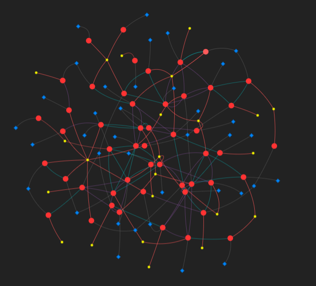

# 나도 직접 한번 해봄

- **🚀  프로젝트 파이프라인**
실제로 코딩할 때 따라가야 할 순서 정립
    
    **1.데이터 전처리 및 피처 추출:**Pandas / NLP 라이브러리 활용.
    결측치를 제거하고 10-core 필터링을 수행합니다. 리뷰 텍스트는 BERT나 TF-IDF를 이용해 벡터($X$)로 변환하고, 라벨을 0과 1로 인코딩합니다.
    
    **2.그래프 구축 (인접 행렬 생성):**NetworkX 또는 DGL/PyG 라이브러리 사용.
    동일한 User, Product, Time을 기준으로 리뷰 노드들을 연결합니다. 파이썬의 `NetworkX`를 사용해 그래프 객체를 만들고, 이를 GNN 프레임워크(PyTorch Geometric 등)가 읽을 수 있는 텐서 형태($A$)로 변환합니다.
    
    **3.GNN 모델 구축 및 학습:**PyTorch Geometric (PyG) 추천.
    GraphSAGE나 GCN 모델을 정의합니다. 훈련/검증/테스트 세트를 분리할 때, 일반적인 랜덤 스플릿이 아닌 그래프 구조를 유지하는 마스킹 기법을 사용해 학습시킵니다. 불균형 해소를 위해 Weighted Loss를 적용합니다.
    
    **4.평가 및 Pyvis 시각화:**결과 분석.
    테스트 세트에서 F1-Score와 AUC를 측정하여 파라미터를 튜닝합니다. 학습이 완료된 후, 예측에 성공한 사기 리뷰 군집 일부를 샘플링하여 `Pyvis`로 넘겨 인터랙티브 웹 시각화 결과물을 생성합니다.
    

---

# 최종

[GNN_최종코드(설명포함).ipynb](GNN_%EC%B5%9C%EC%A2%85%EC%BD%94%EB%93%9C(%EC%84%A4%EB%AA%85%ED%8F%AC%ED%95%A8).ipynb)

[fraud_elite_sim_battleground (rlr 개선 후).html](fraud_elite_sim_battleground_(rlr_%EA%B0%9C%EC%84%A0_%ED%9B%84).html)

# 🕵️‍♂️ 프로젝트: GNN 기반 이기종 그래프 활용 사기 리뷰 탐지

> **작성일:** 2026년 4월 25일 (학술제 중간 보고 및 개인 프로젝트 정리용)
> 
> 
> **핵심 요약:** YelpZip 데이터를 활용하여 유저-리뷰-식당 간의 다차원 관계(Edge)를 정의하고, GraphSAGE 모델을 통해 0.90 수준의 PR-AUC를 달성함.
> 

---

## 1. 🎯 모델링 목표

- **문제 정의:** 단순 텍스트 분류 모델은 리뷰 간의 '조직적 관계'를 파악하지 못함.
- **해결 방안:** 리뷰를 점(Node)으로, 유저/식당/시간/유사도를 선(Edge)으로 연결한 **이기종 그래프(Hetero-Graph)**를 구축하여 네트워크 패턴을 학습함.

---

## 2. 📊 데이터셋 및 전처리 (전략 A, B, C)

사기 리뷰 비율이 **13.2%**인 불균형 데이터를 다루며, 코랩(Colab) 환경의 메모리 제한을 극복하기 위해 다음 전략을 적용함.

### 2-1. 주요 전처리 전략

- **전략 C (기간 분할):** 데이터 밀도가 높은 2013년 이후 데이터(316,895건)만 추출하여 최신 패턴에 집중.
- **전략 A (K-Core 필터링):** 최소 10번 이상 활동한 유저와 식당만 남기는 **10-Core 필터링** 적용. (네트워크 붕괴를 막기 위해 20-Core에서 10-Core로 완화)
- **메모리 최적화:** `float32` 타입 변환 및 가비지 컬렉터(`gc.collect()`)를 활용하여 OOM(Out of Memory) 방지.

---

## 3. 🛠 엣지(Edge) 설계: 사기꾼을 잡는 4개의 그물망

| **엣지 명칭** | **연결 기준** | **설계 의존 (가설)** |
| --- | --- | --- |
| **`rur`** | 동일 유저 | "사기 이력이 있는 유저는 다른 사기 리뷰를 썼을 확률이 높다." |
| **`rpr`** | 동일 식당 | "사기 공격의 타겟이 된 식당은 비정상적 리뷰가 집중된다." |
| **`rtr`** | 동일 주간 + 별점 | "특정 시기에 몰리는 **동시다발적 별점 폭격** 패턴을 포착한다." |
| **`r_sim_r`** | 텍스트 유사도 0.8↑ | "내용을 복사하여 여러 계정으로 올리는 **매크로 작업장**을 적발한다." |
| `rlr` | 텍스트 길이 | 버전2까지는 이걸 사용했으나, 버전3에서 폐기하고 `r_sim_r`사용 |

---

## 4. 🚀 모델링 및 성능 진화 (Evolution)

### **Step 1. 기본 모델 (2-Edge)**

- **구성:** 유저(`rur`)와 식당(`rpr`) 정보만 활용.
- **한계:** 조직적인 '시간 폭격'이나 '복붙 패턴' 식별에 한계가 있음.

### **Step 2. 완전체 모델 (4-Edge)**

- **구성:** 시간(`rtr`)과 텍스트 길이 기반 엣지 추가.
- **지표 전환:** ROC-AUC의 착시를 피하기 위해 **PR-AUC**를 핵심 지표로 도입.
- **성능:** **PR-AUC 0.9011** 달성.

### **Step 3. 정예 모델 (텍스트 유사도 반영)**

- **변화:** 단순 길이 비교를 버리고, **TF-IDF 유사도 연산**을 통해 '진짜 복붙' 944개 엣지로 정예화.
- **결과:** PR-AUC 0.8874. 수치는 미세하게 하락했으나, **모델의 논리적 설명력과 실무적 신뢰도(Robustness)**는 크게 향상됨.

---

## 🔬 5. 인사이트: 무엇이 사기 탐지에 결정적인가? (Ablation Study)

각 엣지를 하나씩 제거하며 성능 하락폭을 테스트한 결과:

1. **유저 연결(rur) [71.9%p 하락]:** 압도적 1위. 계정의 과거 행적이 가장 중요한 단서임.
2. **식당 연결(rpr) [6.6%p 하락]:** 타겟 식당 정보가 두 번째로 중요함.
3. **시간 & 유사도 [각 3%p 내외]:** 단독 기여도는 낮으나, 조직적인 매크로 범죄를 확정 짓는 '결정적 증거' 역할을 수행함.

---

## 🎨 6. 시각화 및 설명 가능한 AI (Explainable AI)

> **핵심 도구:** `Pyvis` (Interactive Network Visualization)
> 
> 
> **목표:** 블랙박스 모델인 GNN이 '왜' 특정 리뷰를 사기로 판단했는지 네트워크 구조를 통해 시각적으로 증명함.
> 

### 6-1. 시각화 도구: Pyvis를 선택한 이유

- **대규모 네트워크 처리:** 수만 개의 노드와 엣지 중 분석에 필요한 부분만 발췌하여 웹 기반(HTML)의 인터렉티브한 그물망으로 구현 가능함.
- **동적 레이아웃:** `barnes_hut` 알고리즘 등을 통해 노드 간의 반발력을 조절, 복잡한 관계를 널찍하고 보기 좋게 자동 배치함.
- **환경 최적화:** 코랩(Colab) 환경 특유의 로딩 오류를 `cdn_resources='remote'` 설정을 통해 해결하여 안정적인 렌더링을 구현함.

### 6-2. 시각화 시나리오 1: Top 50 악성 리뷰 네트워크 분석

- **분석 대상:** 모델이 예측한 사기 확률(`fraud_prob`)이 가장 높은 상위 50개 리뷰와 그 주변 이웃(유저, 식당).
- **시각적 특징:**
    
    
    
    - 🔴 **빨간 노드:** 사기 확신도가 높은 리뷰. (확률이 높을수록 노드 크기가 커짐)
    - **🟡 노랑 노드:** 사기 전적이 많은 악질 유저.
    - 🔵 **파란 다이아몬드:** 사기 공격을 집중적으로 받고 있는 타겟 식당.
- **의의:** 사기꾼(User) → 리뷰(Review) → 식당(Product)으로 이어지는 **조직적 공격의 경로**를 한눈에 파악할 수 있음.

### 6-3. 시각화 시나리오 2: '격전지(Battleground)' 분석 - 정상 vs 사기

- **분석 대상:** 정상 리뷰와 사기 리뷰가 치열하게 섞여 있는 특정 식당의 전체 리뷰 생태계.
- **설명 가능성(Explainability) 포인트:**
    - **색상 대비:** 정상 예측(초록)과 사기 예측(빨강)을 섞어 배치하여 AI의 변별력을 확인.
    - **오답 노트:** 실제 정답과 AI 예측이 다른 노드는 **노란색 두꺼운 테두리**로 표시하여 모델의 한계점과 오판 원인(관계를 통해 사기 예측, 가끔 오판)을 분석함.
        
        
        
- **판단 근거의 시각화 (Edge Logic):**
    
    
    
    - 🟣 **보라색 선:** 같은 주간에 동일한 별점을 남긴 '시간적 폭격' 패턴.
    - 🔵 **청록색 선:** 텍스트 유사도가 80% 이상인 '복사-붙여넣기' 매크로 패턴.
- **의의:** 단순한 확률 수치를 넘어, AI가 **"이 리뷰들이 시간과 내용 면에서 이렇게 촘촘하게 엮여 있기 때문에 사기다"**라고 관리자에게 증거를 제시하는 과정을 구현함.

---

## 💾 7. 모델 보존 및 재사용

- **저장 파일:** `gnn_fraud_model_4edge_best.pth`
- **방식:** 모델의 `state_dict`를 추출하여 저장. 향후 동일한 클래스 구조(4-Edge) 선언 후 가중치를 로드하여 즉시 추론 가능.

---

## 📝 8. 최종 결론 및 느낀 점

1. **데이터의 힘:** 모델의 아키텍처보다, 사기꾼의 행동 패턴을 엣지(`Edge`)로 얼마나 잘 정의하느냐가 성능에 더 큰 영향을 미침.
2. **지표의 중요성:** 불균형 데이터에서는 ROC-AUC보다 **PR-AUC와 Macro F1**을 보는 것이 모델의 진짜 실력을 평가하는 길임.
3. **설명력의 가치:** 단순히 점수만 내놓는 것이 아니라, 시각화 그물망을 통해 **"왜 사기인지"** 관리자에게 증거(보라색/청록색 선)를 보여줄 수 있는 모델이 실무적 가치가 높음.

---

*이 프로젝트는 YelpZip 데이터를 기반으로 GNN의 실무 적용 가능성을 타진해 본 케이스 스터디임.*