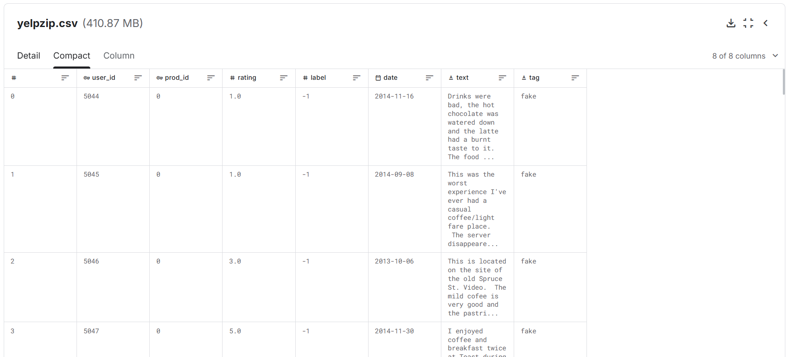

# 학술제 주제 및 가이드라인

- 목차

# 1. 주제

- **주제: 그래프 신경망 기반 조직적 어뷰징 네트워크 탐지(Graph Neural Network-based Systematic Abusing Network Detection)**

## 1. 그래프 신경망(GNN)의 정의 및 개념

그래프 신경망(GNN, Graph Neural Network)이란 데이터 사이의 복잡한 관계를 '점(노드)'과 '선(엣지)'으로 이루어진 그래프 구조로 표현하고, 이를 인공지능이 학습할 수 있도록 설계된 신경망 구조를 의미합니다.

기존의 일반적인 인공지능 모델이 데이터 하나하나를 개별적인 정보로 처리했다면, GNN은 특정 데이터가 주변의 다른 데이터와 어떤 연결 고리를 가지고 있는지, 즉 **상호작용과 맥락**을 함께 학습합니다. 예를 들어, 소셜 네트워크에서 '나'라는 노드는 '친구'라는 노드들과 선으로 연결되어 있으며, GNN은 이러한 연결 관계를 통해 나의 특성을 더 정확하게 파악해 낼 수 있습니다.

---

## 2. 사기 리뷰 탐지에 GNN이 필수적인 이유

기존의 텍스트 분석(NLP)만으로는 사기 리뷰를 완벽히 잡아내는 데 한계가 있습니다. 사기꾼들은 점점 더 정교하게 문장을 작성하여 인공지능을 속이기 때문입니다. 우리가 GNN을 도입해야 하는 논리적 이유는 다음과 같습니다.

### ① 개별 데이터가 아닌 '조직적 패턴' 포착

사기 리뷰는 단순히 글자 하나하나의 문제가 아니라, 특정 세력이 조직적으로 움직이는 **네트워크의 문제**입니다.

- **사용자 기반 연결:** 한 명의 유저가 여러 개의 사기 리뷰를 작성하는 경우, 이 리뷰들은 해당 유저를 중심으로 연결됩니다.
- **시간 및 장소 기반 연결:** 특정 식당에 짧은 기간 동안 갑자기 수십 개의 평점이 쏟아진다면, 이는 시간이라는 선으로 연결된 의심스러운 집단 행동으로 볼 수 있습니다. GNN은 이러한 복잡한 연결망을 한눈에 파악하여, 겉보기에 멀쩡한 리뷰라도 그 배후에 숨겨진 사기 네트워크를 찾아낼 수 있습니다.

### ② 정보의 전파를 통한 정확도 향상

GNN의 핵심 원리는 '주변 정보의 전파'입니다. 만약 어떤 리뷰가 사기 리뷰로 의심된다면, 그 리뷰와 연결된 다른 리뷰들이나 작성자들 역시 사기일 확률이 높아집니다. GNN은 그래프 위에서 이러한 의심 정보를 주고받으며 학습하기 때문에, 단독 데이터만 볼 때보다 훨씬 높은 정확도로 범죄 집단을 식별할 수 있습니다.

### ③ 변칙적인 수법에 대한 유연한 대응

사기꾼들이 리뷰 문구(텍스트)를 바꾼다고 해도, 그들이 수익을 내기 위해 특정 상품에 집중하거나 특정 계정을 돌려쓰는 **구조적인 행동 패턴**까지 숨기기는 매우 어렵습니다. GNN은 데이터 간의 연결 방식(엣지)을 어떻게 설계하느냐에 따라 새로운 사기 수법도 효과적으로 방어할 수 있는 강력한 도구가 됩니다.

---

## 3. 요약 및 기대 효과

본 학술제에서 여러분은 제공된 YelpZip 데이터를 바탕으로 리뷰들을 노드로 설정하고, 사용자, 작성 시간, 별점 등 다양한 기준을 활용해 이들을 연결하는 선을 설계하게 됩니다.

단순히 "이 글이 가짜인가?"를 고민하는 단계를 넘어, "이 리뷰들이 어떤 커넥션을 형성하고 있는가?"를 그래프 구조로 증명해 내는 것이 이번 프로젝트의 핵심입니다. 이를 통해 여러분은 데이터 사이의 숨겨진 관계를 읽어내는 통찰력을 기르고, 실제 이커머스 생태계를 교란하는 작업장을 원천 차단할 수 있는 실효성 있는 모델을 구축하게 될 것입니다.

# 2. 데이터셋

**링크** : https://www.kaggle.com/datasets/vaibhavsonkar/yelpzip

- **데이터셋 설명**
    
    # 데이터셋
    
    ## **(1) YelpZip 원본 리뷰 데이터셋**
    
    
    
    - **데이터 개요:** Yelp의 실제 추천/필터링 시스템 알고리즘을 거쳐 수집된 약 60만 개 이상의 대규모 식당 및 비즈니스 리뷰 원본 데이터입니다. 본 대회의 메인 데이터셋으로, 참가자들은 이 데이터를 바탕으로 숨겨진 스팸(사기) 네트워크를 발굴해 내야 합니다.
    - **활용 목적:** 제공된 텍스트(Raw Text)를 자연어 처리(NLP) 모델로 임베딩하여 그래프의 '노드(점)'로 만들고, 대시보드 시각화 단계에서 작업장 리뷰의 증거 자료(화면 팝업 텍스트)로 활용합니다.
    
    - **컬럼(Column) 상세 설명:**
        - `text` **:** 리뷰의 원본 텍스트. 자연어 처리(BERT 등)를 통한 임베딩 추출 및 대시보드 시각화 시 '사기 증거'로 화면에 보여줄 필수 데이터입니다.
        - `user_id`: 리뷰를 작성한 유저의 고유 식별자. (Tip: 같은 유저가 쓴 리뷰들을 선으로 묶어보는 아이디어를 고민해 보세요!)
        - `prod_id`: 대상 식당/상품의 고유 식별자. (같은 식당에 달린 리뷰들끼리 선으로 연결할 때 사용합니다.)
        - `label` **(정답지):** 정상 리뷰(0)와 사기/위장 스팸 리뷰(1)를 구분하는 타겟 변수이며, 모델의 최종 탐지 목표입니다.
            - **[중요] Label 변환 주의사항**
                
                기존 YelpZip 데이터는 사기가 `-1`, 정상이 `1` 로 라벨링 되어 있습니다. 필수적으로 **사기는 `1`, 정상은 `0`**으로 라벨을 변환하고 시작하여야 합니다. 반드시 필수 전처리(**사기는 `1`, 정상은 `0`**으로 라벨을 변환)를 실행한 후 진행하시기 바랍니다.
                
        - `date`: 리뷰가 작성된 날짜. (특정 기간에 집중적으로 쏟아진 '별점 테러'나 작업장을 탐지하는 시간 기반 연결선(Edge)을 만들 때 유용합니다.)
        - `rating`: 유저가 부여한 별점 (1~5점). 노드의 추가 정보(Feature)로 활용할 수 있습니다.
        - `tag`: 리뷰에 부여된 추가 메타 태그 정보 (필요에 따라 보조 데이터로 활용 가능합니다.)
    
    ## **(2) YelpChi, Amazon 데이터셋 (참고용)**
    
    링크 :  [CARE-GNN/data at master · YingtongDou/CARE-GNN](https://github.com/YingtongDou/CARE-GNN/tree/master/data)
    
    - **데이터 개요:** 위 YelpZip 데이터셋에서 시카고(Chicago) 지역 데이터만 추출하여, 연구자들이 GNN(그래프 신경망)에 맞게 수학적인 노드와 엣지(관계선)로 미리 가공해 둔 학술용 벤치마크 데이터입니다.
    - **활용 목적:** 본 대회에서는 YelpChi 데이터 자체를 모델 학습에 직접 사용하지 않습니다. 대신, 참가자들이 **"리뷰들을 대체 어떤 기준으로 묶어야(Edge) 스팸 네트워크가 드러나는가?"**에 대한 좋은 아이디어와 수학적 계산법(설계도)을 참고하여 원본 데이터(YelpZip)에 직접 적용해 볼 수 있도록 돕는 나침반 역할을 합니다.
    
    ### ① YelpChi 데이터셋 (시카고 지역 식당/호텔 리뷰)
    
    - **목적:** 가짜/스팸 리뷰(Spam Review) 탐지
    - **노드 (Node):** 각각의 ‘리뷰(Review)’가 하나의 점이 됩니다.
    - **정답지 (Label):** 0 (정상 리뷰), 1 (스팸 리뷰)
    
    **그래프 연결 방식 (3가지 엣지 참고):**
    
    이 데이터셋에 피처로 들어있는  `net_rur`, `net_rtr`, `net_rsr` 의 의미는 다음과 같습니다.
    
    - **R-U-R (Review-User-Review):** 같은 ‘**사용자(User)’**가 작성한 리뷰들끼리 선으로 연결
    - **R-T-R (Review-Time-Review):** 같은 식당/호텔에 대해 같은 ‘**달(Month/Time)’**에 작성된 리뷰들끼리 연결 (특정 시기에 알바를 풀어 평점을 조작하는 것을 잡기 위함)
    - **R-S-R (Review-Star-Review):** 같은 식당/호텔에 대해 같은 **‘별점(Star)’**을 준 리뷰들끼리 연결
    
    ---
    
    ### ② Amazon 데이터셋 (아마존 악기 카테고리 리뷰)
    
    - **목적:** 리뷰 자체가 아닌 사기꾼 사용자(Fraudster) 탐지
    - **노드 (Node):** 각각의 **'사용자(User)'**가 하나의 점이 됩니다.
    - **정답지 (Label):** 0 (정상 유저), 1 (사기꾼 유저)
    
    **그래프 연결 방식 (3가지 엣지 참고):**
    이 데이터셋에 피처로 들어있는  `net_upu`, `net_usu`, `net_uvu` 의 의미는 다음과 같습니다.
    
    - **U-P-U (User-Product-User):** 적어도 하나 이상 동일한 **‘제품(Product)’**에 리뷰를 남긴 사용자들끼리 연결
    - **U-S-U (User-Star-User):** 동일한 제품에 같은 **‘별점(Star)’**을 준 (특히 짧은 기간 내에) 사용자들끼리 연결
    - **U-V-U (User-Vocab/View-User):** 서로 작성한 리뷰 본문의 **‘텍스트 유사도(TF-IDF 기준)’**가 상위 5% 이내로 아주 비슷한 사용자들끼리 연결 (복붙해서 리뷰를 남기는 매크로를 잡기 위함)
    
    ## (3) 기타
    
    추가적으로 기타 다른 데이터도 보완적으로 참고 가능합니다.
    

# 3. 참가자 가이드라인

## (1) 개요

본 대회의 핵심은 **`YelpZip` 원본 데이터셋을 활용하여 GNN(그래프 신경망) 기반 조직적 어뷰징 네트워크 탐지 모델을 구축하여 이를 대시보드로 나타내는 것**입니다.

---

## (2) 필수 사항 (※ 미준수 시 감점)

공정한 평가와 대회 취지 달성을 위해 아래의 사항들을 반드시 지켜주셔야 합니다.

1. **샘플링 및 분할 규정**: 먼저 샘플링 후 데이터 분할 하도록 합니다.

**① 서브그래프(Sub-graph) 샘플링 전략**
• **무작위 추출 금지**: 단순 무작위 추출은 노드 간 연결성을 파괴하여 GNN 학습을 불가능하게 하므로 금지합니다. 
• **밀도 중심 샘플링**: 아래의 추천 전략을 활용하여 관계가 조밀하게 엮인 **1만 개~5만 개** 사이의 노드를 추출하십시오. (추천 전략이며, 해당 전략들을 여러 개 사용하거나 다른 전략을 사용하여도 됩니다.

    ◦ **전략 A**: 리뷰가 집중된 상위 N개 식당(Product) 중심 추출 
    ◦ **전략 B**: 왕성하게 활동하는 상위 N명 유저(User) 중심 추출 
    ◦ **전략 C**: 특정 연도/월 등 특정 타임라인(Time-window) 중심 추출 

**② 데이터 분할 (Split) 규칙**
• **분할 시점**: 반드시 위 전략에 따라 **샘플링이 완료된 서브그래프 내에서** 데이터를 분할해야 합니다.
• **분할 비율**: 서브그래프 내의 노드를 학습용 80%(train/valid 비율은 80% 안에서 무관), 시험용 20%의 비율로 분할하여 사용하십시오.
• **재현성 확보**: 성능 평가의 신뢰도를 위해 분할 시 사용한 코드와 `random_state` 등 하이퍼파라미터를 보고서에 명시해야 합니다.

1. **데이터 가공 규정 준수:** 본 대회는 Kaggle의 원본 데이터를 사용하므로, 아래 규정에 맞게 참가자가 직접 전처리를 수행해야 합니다.
- **라벨 변환:** 원본의 `label` 컬럼 값 중 **사기(-1)를 1**로, **정상(1)을 0**으로 반드시 변환해야 합니다.

1. **GNN 모델 사용 필수 :** 본 대회의 목적은 그래프 네트워크의 이해와 활용에 있습니다. 따라서 **반드시 GNN 계열의 모델을 핵심으로 사용**해야 하며, 단순 머신러닝/딥러닝 모델만 단독으로 사용할 경우 큰 감점이 부여됩니다.
- **GNN 모델 구조 설계 조건:** 통일성 있는 평가를 위해 아래의 노드 및 엣지 구성 기준을 준수해 주세요.
    - **노드(Node):** '리뷰(Review)' 단위로 고정합니다.
    - **관계/엣지(Edge):** **기본 Relation 1개 + 커스텀 Relation 1개 이상**을 반드시 포함해야 합니다.
        - **기본 Relation (택 1 필수):** 동일 사용자 기반(R-U-R), 동일 기간 기반(R-T-R), 동일 별점 기반(R-S-R) 중 최소 하나를 포함하세요.
        - **커스텀 Relation (창의성 평가 요소):** 참가팀의 도메인 지식과 아이디어를 발휘하여 창의적으로 설계해 주십시오. 가이드로 제공된 데이터셋(`YelpChi`, `Amazon`)은 좋은 참고 자료일 뿐, 참가자분들 만의 새로운 연결 방식과 파생 변수를 설정해 보시기를 적극 권장합니다.

## (3) **단계별 수행 미션 및 제출물 안내**

본 대회는 참가자들의 부담을 줄이고 완성도를 높이기 위해 **예선(2주)**과 **본선(1주)**으로 나누어 진행됩니다.

---

### **📌 [Phase 1] 예선 (진행 기간: 5/2~5/15)**

데이터를 이해하고, 창의적인 엣지를 설계하여 예측 성능이 우수한 GNN 모델을 구축하는 단계입니다.

- **수행 미션:**
    1. **데이터 샘플링 및 전처리:** 서브그래프 추출 및 텍스트 임베딩 등
    2. **그래프 네트워크 설계:** 파생 변수 생성 및 커스텀 엣지 구축 (예: 특정 시간대 리뷰 연결, 평점 기준 연결, 리뷰 텍스트 유사도 기반 연결 등)
    3. **GNN 모델링 및 최적화:** 다양한 GNN 계열 모델(GCN, GAT, GraphSAGE 등) 비교 실험 및 성능 튜닝
- **제출물:**
    
    **① 분석 보고서 (PDF):** 전처리 과정, 모델 선택 이유, 엣지 설계의 논리적 근거 등을 상세히 담은 줄글 형태의 자유 양식 보고서 (5~20 page 내외, 상세 양식은 하단의 '4. 보고서 양식' 참고)
    
    - 필수적으로 test set에 대한 모델의 **PR-AUC**와 **Macro F1** 성능지표를 포함해야 합니다. (모델 성능 평가에 사용)
    
    **② 예선용 제출 코드**
    

---

### **📌 [Phase 2] 본선 (진행 기간: 5/16~5/23 / 예선 통과 팀 한정)**

예선에서 만든 GNN 모델의 결과를 바탕으로, 사기 리뷰 네트워크의 구조적 특징을 시각적이고 직관적으로 보여주는 단계입니다.

- **수행 미션:**
    1. GNN의 **설명 가능성(Explainability)**을 살린 시각화 로직 구현
    2. 대시보드(Streamlit, Dash 등) 형태의 웹 UI/UX 구현
    3. 청중을 설득할 수 있는 스토리텔링 및 발표 자료 제작
- **제출물:**
    
    **① 발표용 PPT** (PDF 변환 제출)
    
    **② 업데이트된 분석 보고서** (PDF)
    
    - **양식:** 노션에 게시된 보고서 양식을 활용해 주시기 바랍니다.
    - **내용:** 예선 제출본을 바탕으로 본선 기간 동안 발전된 로직이나 수정된 모델 내용 등을 반영하여 작성해 주세요.
    
    **③ 시각화 결과물 및 관련 자료**
    
    - **[필수 제출] 시각화 결과물:** 대시보드 URL 링크, 데모 구동 영상, HTML 파일 등 실제 구현된 시각화 결과를 확인할 수 있는 형태라면 모두 제출 가능합니다.
    - **[선택 제출] 시각화 요약 보고서 (5페이지 이내, PDF):** 시각화 도출 과정과 결과물에 대한 부가적인 설명을 담은 별도의 문서입니다.
    - *※ 안내 사항:*
        - 선택 보고서를 제출하더라도 **[필수 제출]인 시각화 결과물(HTML, 링크, 영상 등)은 반드시 함께 제출**하셔야 합니다. (보고서가 결과물 원본을 대체할 수 없습니다.)
        - 시각화 요약 보고서를 별도로 제출하지 않으시는 팀은, 해당 시각화 관련 내용을 본선 발표 당일 프레젠테이션에 포함하여 주시기 바랍니다.
    
    **④ 최종 코드**
    

# 4. 채점기준

## (1) 예선 점수 (총 100점)

| **평가 부문 (배점)** | **세부 항목 (배점)** | **심사 기준** |
| --- | --- | --- |
| **GNN 분류 모델 성능 (10점)** | **PR-AUC 및 MACRO F1 (10점)** | 제출한 보고서에 나오는 결과 반영 |
| **논리성 (90점)** | **데이터 (20점)** | 적절한 전처리, EDA 및 데이터 분석 기법을 사용했는지? |
|  | **논리성 (20점)** | GNN 모델 구축 과정이 논리적으로 잘 맞고 근거가 명확한지? |
|  | **창의성 (25점)** | 기존에 생각하기 어려웠던 참신한 관점으로 문제에 접근했는지? |
|  | **실효성 (25점)** | 현실적으로 이 모델과 분석 결과가 실무적 의미를 가지는지? |

## (2) 본선 점수 (총 100점)

| **평가 부문 (배점)** | **세부 항목 (배점)** | **심사 기준** |
| --- | --- | --- |
| **GNN 분류 모델 성능 (10점)** | **PR-AUC 및 MACRO F1 (10점)** | 제출한 보고서에 나오는 결과 반영 |
| **논리성 (40점)** | **데이터 (5점)** | 적절한 전처리, EDA 및 데이터 분석 기법을 사용했는지? |
|  | **논리성 (5점)** | GNN 모델 구축 과정이 논리적으로 잘 맞고 근거가 명확한지? |
|  | **창의성 (15점)** | 기존에 생각하기 어려웠던 참신한 관점으로 문제에 접근했는지? |
|  | **실효성 (15점)** | 현실적으로 이 모델과 분석 결과가 실무적 의미를 가지는지? |
| **시각화 (40점)** | **시각적 설명력 (20점)** | 정상 네트워크와 사기(스팸) 네트워크의 구조적 특징과 관계성이 직관적으로 명확하게 구분되도록 시각화했는지? |
|  | **UI/UX 완성도 (20점)** | 대시보드(웹 등)가 실제 분석 환경에서 활용하기 적합하도록 직관적이고 완성도 높게 구현되었는지? |
| **발표 점수 (10점)** | **전달력 (10점)** | 청중들에게 설득력 있는 발표였는지? |

# 5. 보고서 양식

- 보고서 규격
    - 용지 규격: A4
    - 폰트/디자인: 자유 (단, 가독성이 좋은 폰트 사용 권장)
    - 본문 글자 크기: 11pt 고정 (제목, 목차, 도표 내 글자 크기는 자유)
    - 여백 및 줄간격: 각 프로그램(한글/워드)의 기본 설정값 유지
    - 분량: 5페이지 ~ 20페이지 이내 (표지 및 목차 제외)
- 보고서 제출 양식
    
    <모델링 결과물 제출 양식>
    
    1. 모델링 목표 정의
    2. 데이터 구성 및 전처리 과정
        
        2-1 사용 데이터
        
        2-2. 전처리 내용
        
        2-3. 파생 변수(Feature) 및 그래프 엣지(Edge) 설계 근거
        
    3. 모델 선택 이유와 적용 과정
        
        3-1. 선택한 모델
        
        3-2. 모델 선택 이유
        
        3-3. 모델 적용 과정
        
    4. 모델 성능 평가&결과 해석
        
        4-1. 평가 지표
        
        4-2. 모델 성능 결과 **(반드시 PR-AUC와 MACRO F1 점수 포함)**
        
        4-3. 결과 해석
        
    5. 모델 기반 인사이트 및 활용 방안
    6. 모델링의 한계와 보완 계획
    7. 참고 코드(선택)
    8. 추가 참고 자료(선택)

# 6. 참가자 Q&A 정리

- **Q1. GNN 외에 다른 머신러닝/딥러닝 모델을 함께 사용해도 되나요?**
    
    **A. 네, 다른 모델을 자유롭게 활용하셔도 좋습니다!** 모델 사용에 별도의 제한 사항은 없습니다. 다만, 이번 학술제의 핵심 과제가 '그래프 데이터의 활용'인 만큼 **모든 채점과 평가는 GNN(Graph Neural Network)을 중심으로 진행**되고, GNN 모델을 사용하지 않을 시에는 큰 감점이 부여됩니다. 따라서 GNN을 메인 모델 혹은 파이프라인의 핵심으로 두고, 다른 분석 기법들을 어떻게 조화롭게 결합할지 다방면으로 고민해 보시길 권장합니다.
    
- **Q2. 제공된 메인 데이터(Yelpzip) 외에 다른 외부 데이터(직접 수집 포함)를 사용해도 되나요?**
    
    **A. 네, 외부 데이터 활용은 대환영이며 모델의 현실성을 보여줄 수 있는 좋은 시도입니다!**
    단, 참가팀 간의 공정한 평가를 위해 **반드시 제공된 기본 데이터(Yelpzip)를 활용하여 베이스라인(Baseline) 성과를 먼저 증명**해 주셔야 합니다. 그러므로 분석보고서에 기본 데이터(Yelpzip)를 활용하여 구한 PR-AUC와 Macro F1 점수는 반드시 포함하여 주시기 바랍니다.
    
    Yelpzip 데이터로 모델을 성공적으로 구축한 후, 다른 오픈 데이터(YelpChi, Amazon 등)나 직접 수집한 데이터를 추가로 활용해 모델의 확장성(Extension)을 실험해 보세요. 만약 직접 수집한 데이터에 정답(Label, 즉 사기리뷰 여부)이 없다면, 비지도 학습 등 다양한 접근 방식을 통해 우리 모델이 얼마나 현실에서도 잘 작동하는지 자유롭게 증명해 주시면 됩니다.
    
- **Q3. 데이터를 어떻게 편집하느냐에 따라 성능이 천차만별인데, 성능 평가의 구체적인 채점 기준은 어떻게 되나요?**
    
    **A. 구체적인 커트라인(점수)은 비공개입니다. 다만 채점 방식을 쉽게 설명해 드리면, '운영진이 설정한 일정 기준치(Threshold)를 넘겼는가?'를 기준으로 점수가 부여됩니다.**
    
    즉, 소수점 끝자리까지 비교해서 가장 높은 점수를 낸 팀 순서대로 줄을 세우는 방식이 아닙니다. 내부적으로 정해둔 일정 기준치를 통과하면 성능 부문에서 우수한 점수를 받게 되며, 기준치에 미달할 경우에는 그에 따른 차등(감점) 점수가 부여됩니다.
    
    운영진 역시 데이터 가공 방식에 따라 성능 지표가 크게 변동할 수 있다는 점을 충분히 인지하고 있습니다. 따라서 무작정 성능지표 숫자를 높이기 위해 시간을 쏟기보다는, **일정 수준의 성능을 달성한 이후에는 데이터를 다루는 논리적인 과정과 모델의 설명력에 집중**하여 프로젝트를 완성해 주시기를 권장합니다.
    
- **Q4. 안녕하세요, 혹시 노드 ‘단위'를 리뷰로 고정한다는 의미가, 분류 대상 노드만 리뷰면 되고 보조 노드(User, Product 등 heterogeneous graph 구성용)는 허용되는지, 아니면 그래프의 모든 노드가 리뷰여야 하는지 명확히 알려주실 수 있을까요? 저희는 Heterogeneous GNN 구조로 Review 외에 User/Product 노드를 보조로 사용했는데 규정 부합 여부 확인하고 싶습니다.**
    
    **A. 가이드라인에서 노드 단위를 리뷰로 고정한 것은 본 대회의 핵심 과업이 리뷰 노드에 대한 Node Classification 문제임을 명시하기 위함입니다.**
    
    **분류 대상 노드만 리뷰 노드면 되고, Product, Date 등을 보조 노드로 설정하는 것은 가능합니다**
    

# 7. 메일 제출 안내

- **예선**
    
    📌 제출 안내
    
    - 제출물 : 분석 보고서 (PDF 형식), 예선용 분석 코드
    - 제출처 : [dataitda5@gmail.com](mailto:dataitda5@gmail.com)
    - 마감 기한 : ~ 5월 15일(금) 13:00 (시간엄수)
    
    📌 제출 양식
    
    - 메일 제목 : [예선제출] 팀명_프로젝트명
    - 파일 이름 : 팀명_분석보고서.pdf / 팀명_분석코드.zip
- **본선**
    
    📌 제출 안내
    
    - 제출물 : ① 발표용 PPT (PDF 변환 제출), ② 업데이트된 분석 보고서 (PDF), ③ 시각화 결과물 및 관련 자료, ④ 최종 코드
    - 제출처 : [dataitda5@gmail.com](mailto:dataitda5@gmail.com)
    - 마감 기한 : ~ 5월 21일(목) 자정(24시) (시간엄수)
    
    📌 제출 양식
    
    - 메일 제목 : [본선제출] 팀명_프로젝트명
    - 파일 이름 : ① 팀명_PPT.pdf ② 팀명_최종분석보고서.pdf ③ 팀명_시각화결과물 / 팀명_시각화요약보고서 ④팀명_분석코드.zip